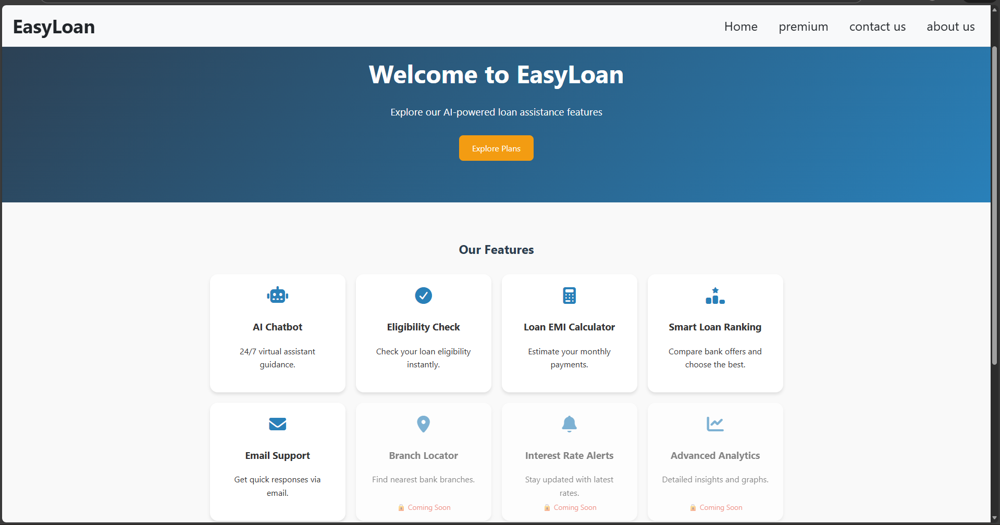
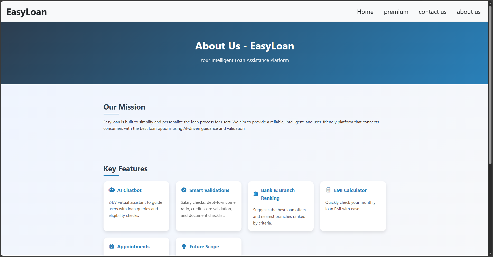
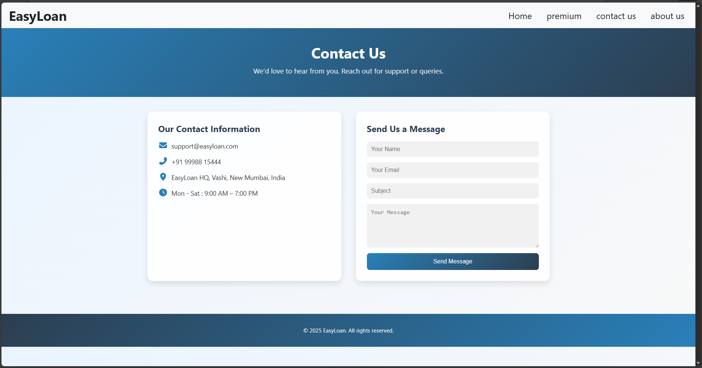
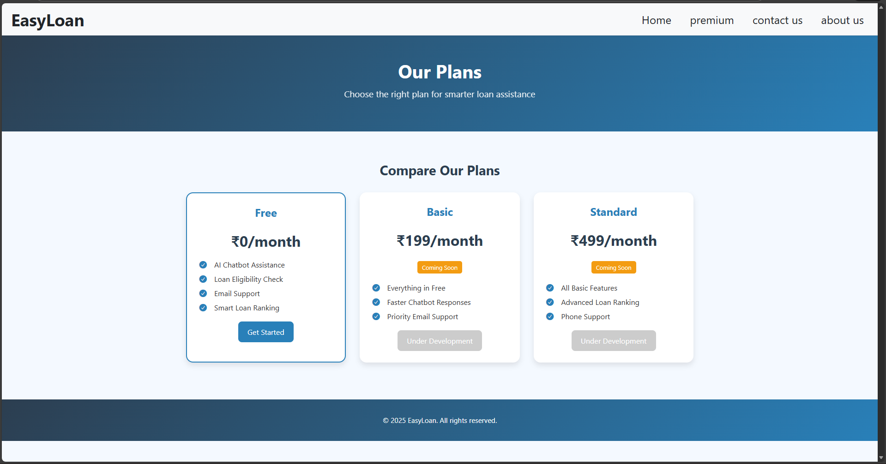

# 💰 EasyLoan – Loan Information & Assistance Platform

EasyLoan is a **full-stack web-based application** developed to help users **understand, calculate, compare, and plan loans** in a simple and user-friendly way.  
The platform focuses on **clean frontend design**, **robust backend logic**, **AI-powered assistance**, and **service integrations** to simplify complex loan-related decisions.

---

## 📌 Project Overview

Loan processes are often complex and confusing for users.  
EasyLoan provides a **single platform** where users can calculate EMI, check eligibility, compare loans, and get guidance through an AI chatbot.

The project is designed with a strong focus on **usability, accuracy, and real-world application**.

---

## 🖼️ Application Screens

  
  &nbsp;&nbsp;
  

  <b>Home</b>
  &nbsp;&nbsp;&nbsp;&nbsp;&nbsp;&nbsp;&nbsp;&nbsp;&nbsp;&nbsp;&nbsp;&nbsp;&nbsp;&nbsp;&nbsp;&nbsp;
  <b>About Us</b>

  
  &nbsp;&nbsp;
  

  <b>Contact Us</b>
  &nbsp;&nbsp;&nbsp;&nbsp;&nbsp;&nbsp;&nbsp;&nbsp;&nbsp;&nbsp;&nbsp;&nbsp;&nbsp;
  <b>Premium</b>

---

## 🚀 Key Features

### 📊 EMI Calculator
- Calculates monthly EMI based on loan amount, interest rate, and tenure  
- Instant and accurate results  
- Simple and user-friendly interface  

### ✅ Loan Eligibility Checker
- Helps users determine loan eligibility  
- Uses basic financial parameters  
- Displays clear and understandable results  

### 🏦 Bank & Loan Comparison
- Compare loan options from multiple banks  
- View interest rates and loan details  
- Helps users make informed decisions  

### 🤖 AI Chatbot Assistance
- Integrated AI chatbot using **Gemini API**  
- Provides instant responses to loan-related queries  
- Explains loan concepts in simple language  

### 📧 Email Communication Service
- Integrated **EmailJS** service  
- Used for contact forms and user queries  
- Enables email communication without backend mail server  
- Improves user interaction and feedback handling  

### 🎨 Clean & Responsive UI
- Frontend-focused design approach  
- Responsive layout for different screen sizes  
- Minimal and user-friendly interface  

---

## 🛠️ Technology Stack

### 🌐 Frontend
- HTML  
- CSS  
- JavaScript  

### ⚙️ Backend
- Node.js  
- Express.js  

### 🗄️ Database
- MongoDB  

### 🤖 AI & Services
- Gemini API (AI Chatbot)  
- EmailJS (Email communication service)

---

## 🔁 System & API Flow Explanation

1. **User Interaction (Frontend)**  
   Users enter loan details or submit queries through the web interface.

2. **Backend Processing**  
   Backend processes EMI calculation, eligibility logic, and bank comparison.

3. **Database Interaction**  
   MongoDB stores and retrieves loan-related data.

4. **AI Chatbot Integration**  
   User queries are sent to the AI service, which returns intelligent responses.

5. **Email Service Handling**  
   User messages are sent using EmailJS for communication.

6. **Response to User**  
   Results and responses are displayed on the frontend in real time.

---

## 🎥 Project Demo (Video Output)

▶ **Watch the complete project demo:**  
[Click here to watch the demo video](./screenshots/20260106-2045-29.9749483.mp4)

> The demo video showcases all major features and user workflows of the EasyLoan platform.

---

## 🎯 Project Objectives

- Simplify loan-related decision-making  
- Provide accurate EMI and eligibility calculations  
- Enable easy loan comparison  
- Assist users using AI-based guidance  
- Build a real-world full-stack web application  

---

## 📂 Use Cases

- Students planning education loans  
- Individuals checking personal or home loans  
- Users comparing bank loan offers  
- Learners exploring full-stack development  

---

## 🔮 Future Enhancements

- User authentication and profiles  
- Loan application tracking  
- More bank integrations  
- Advanced AI recommendations  
- Improved UI animations and dashboards  

---

## 🧪 Project Status

- ✔ Core features implemented  
- ✔ Backend and database integrated  
- ✔ AI chatbot functional  
- ✔ Email communication service integrated  
- 🔄 Enhancements planned  

---

⭐ **EasyLoan – Making loan decisions simple, smart, and accessible.**
